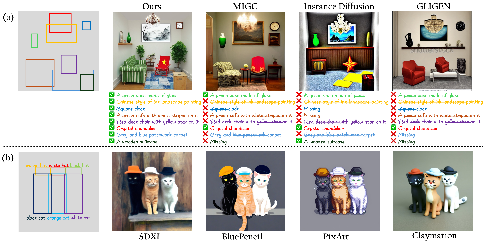
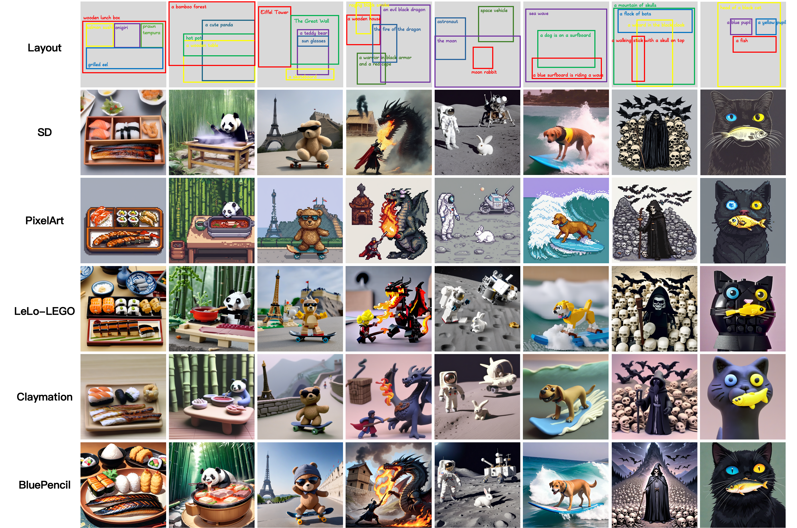

<div align="center">

<h1>IFAdapter: Instance Feature Control for Grounded Text-to-Image Generation</h1>

<div>
Yinwei Wu<sup>1,2</sup>&emsp;Xianpan Zhou<sup>1</sup>&emsp;Bing Ma<sup>1</sup>&emsp;Xuefeng Su<sup>1</sup>&emsp;Kai Ma<sup>1</sup>&emsp;Xinchao Wang<sup>2</sup><sup>&dagger;</sup>
</div>
<div>
    <sup>1</sup>Tencent PGC&emsp;
    <sup>2</sup>National University of Singapore&emsp;
    <sup>&dagger;</sup>corresponding author 
</div>

</div>

---
## Overview


We introduce the **I**nstance **F**eature **Adapter**(IFAdapter) to to exert fine-grained control over the generation of multiple instances.

## Features
The IFAdapter is readily integrated with various community models and LoRAs!

We show the results of IFAdapter in combination with [PixelArt](https://civitai.com/models/120096/pixel-art-xl), [Lelo-Lego](https://civitai.com/models/92444/lelo-lego-lora-for-xl-and-sd15), [Claymation](https://huggingface.co/DoctorDiffusion/doctor-diffusion-s-claymation-style-lora), and [Bluepencil](https://civitai.com/models/119012/bluepencil-xl). We express our gratitude for these great work contributed by these communities!

## Quick Start

Install the required dependencies
```bash
git clone https://github.com/WUyinwei-hah/IFAdapter.git

cd IFAdapter

pip install -r requirements.txt
```

## Generation

1.
Use the original SDXL for generation
```python
python3 infer.py
```

2.
Use LORAs for generation
```python
python3 infer_loras.py
```
---

## Citation
```
@article{wu2024ifadapter,
  title={Ifadapter: Instance feature control for grounded text-to-image generation},
  author={Wu, Yinwei and Zhou, Xianpan and Ma, Bing and Su, Xuefeng and Ma, Kai and Wang, Xinchao},
  journal={arXiv preprint arXiv:2409.08240},
  year={2024}
}
```